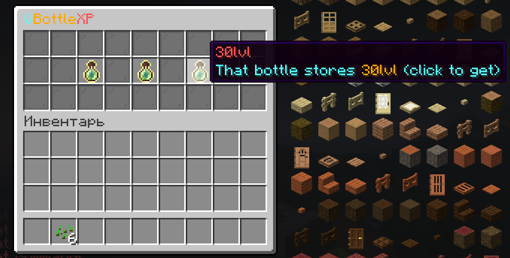
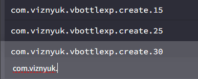

# VBottleXP - GUI

# Store you xp at the bottle and use it whenever you want!
# FULLY CUSTOMIZABLE GUI

# Pre-installed languages:
## All languages are support Placeholder API (custom included)
### [ ] ru - russian
### [ ] en - english
### [ ] ukr - ukrainian
## Your language doesn't listed? Not a problem! Create you own lang_{lang}.yml and choose is in the config.yml!

# Commands:

```yml
    xpbottle:
      usage: /vxp
      aliases:
        - xpbottle
        - vxpbottle
```

# Permissions:
```yml
  com.viznyuk.vbottlexp.use:          # Use custom bottle
    default: false
  com.viznyuk.vbottlexp.command:      # Use /xpbottle command
    default: op
  com.viznyuk.vbottlexp.create.*:     # Creating ANY xp bottle
    default: op
  com.viznyuk.vbottlexp.create.{x}:   # Creating xp bottle with selected level. Where x is level (look further)
```


# Customize GUI
## Don't you like how does GUI looks? You can fully customize it from the template!
```yml
# items.yml
structure:
  # inventory height
  height: 3
  # each row has to count 9 chars
  rows:
    - "#########"
    - "##1#2#3##"
    - "#########"

items:
  '#':
    type: fill
    material: gray_stained_glass_pane
    name: '§f[§bV§6Bottle§cXP§f]'


  '1':
    type: bottle
    # level that will be stored
    level: 15
    # item name in GUI and when a player take it
    name: '§a15lvl'
    # item lore in GUI
    lore: "§bThat bottle stores §615lvl§b (click to get)"
    # item lore when player take it
    final-lore: "§bThat bottle stores §615lvl§b"
    permission: com.viznyuk.vbottlexp.create.15

  '2':
    type: bottle
    level: 25
    name: '§b25lvl'
    lore: "§bThat bottle stores §625lvl§b (click to get)"
    final-lore: "§bThat bottle stores §625lvl§b"
    permission: com.viznyuk.vbottlexp.create.25


  '3':
    type: bottle
    level: 30
    name: '§c30lvl'
    lore: "§bThat bottle stores §630lvl§b (click to get)"
    final-lore: "§bThat bottle stores §630lvl§b"
    permission: com.viznyuk.vbottlexp.create.30


```


